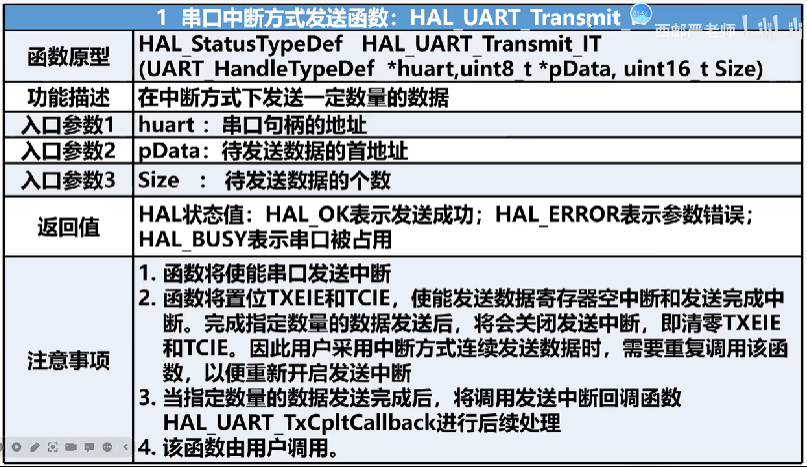
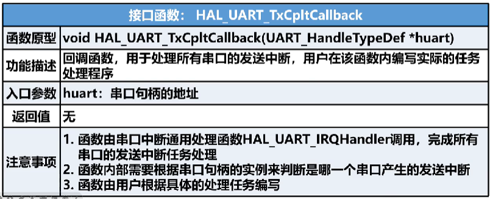

## 目录

[toc]


## 一、串行通信


- 特点

  数据逐位传输，传输线少，长距离传输时成本低，但数据的传输控制较复杂。按照实现数据同步的方式，可以分为**同步串行**和**异步串行**两种

1. 同步串行

   

   - 特点

     数据传输一数据块（一组字符）为单位，在一个数据块内，字符与字符间无间隔，收发双方依靠独立的时钟线进行信号的同步。适用于大批量的数据传输

2. 异步串行通信

   

   - 特点

     数据传输一单个字符为单位，字符和字符之间的间隙任意，字符内部每一位持续的时间相同。收发双方没有专门的时钟信号，而是依靠事先约定的字符格式和通信速率来完成通信

   1. 异步串行通信的字符格式

      

      

   2. 异步串行通信的通信速率

      波特率：每秒钟传送二进制数码的位数，以bit/s(bps)为单位

      

      

   3. 异步串行通信准确性

      异步串行通信的两个关键点：**字符格式**、**波特率**

      

      传输数据的时候低位在前，高位在后，例如上图位发送0xE9

## 二、串口收发单元

1. 串口收发单元功能框图

   

2. 数据寄存器

   

   

3. 通信状态标志位  

   

## 三、串口数据类型


1. 串口句柄

   

   

2. 串口初始化数据类型

   

   - 数据长度

     

   - 停止位长度

     

   - 奇偶校验位

     

   - 通信方式

     

   - 硬件流控制

     硬件流控制可以控制数据传输的进程，防止数据的丢失，

     该功能主要用在收发双方传输速度不匹配的时候使用

     

   - 采样频率

     

## 四、串口初始化设计思想

1. 设计思想

   

   

2. 串口初始化过程

   

   

   

## 五、串口轮询接口

1. 发送函数

   

2. 接收数据

   

## 六、任务--串口轮询固定长度的数据发送

> 任务目标：掌握Cube MX软件配置串口实现轮询方式的通信方法
>
> 任务内容：从串口助手发送5个字符到开发板，开发板接收到后将字符原样发送回串口助手

1. CubeMX配置

   

2. 实验代码

   ```c
   uint8_t Rx_buff[10] = "";
   
   while(1)
   {
   //接收5个字符
     if(HAL_UART_Receive(&huart1, Rx_buff, 5, 100)      == HAL_OK){
       HAL_UART_Transmit(&huart1, Rx_buff, 5, 100);
     }
   }
   ```

## 七、串口中断接口

1. 串口中断方式的特点

   

2. 中断发送函数

   发送过程：**每发送一个数据进入一次中断，在中断中根据发送数据的个数来判断数据是否发送完成**

   

3. 中断接收函数

   接收过程：**每接收一个数据进入一次中断，在中断中根据接收数据的个数来判断数据是否接收完成**

   

4. 串口中断回调函数

   

5. 串口中断使能

   

6. 串口中断标志查询

   

7. 串口空闲中断标志清零函数

   

## 八、任务--串口中断固定长度的数据发送

> 任务目标：掌握CubeMX软件配置串口实现中断方式通信的方法
>
> 任务内容：利用串口助手，从PC上发送10个字符到开发板，开发板收到后原样发回串口助手

1. 设计思路

   

2. CubeMX配置

   

3. 实验代码

   ```c
   #include "main.h"
   #include "usart.h"
   #include "gpio.h"
   
   static uint8_t Rx_flag = 0;
   uint8_t Rx_buff[10];
   
   int main(void)
   {	
     HAL_UART_Receive_IT(&huart1, (uint8_t *)Rx_buff, 10);
   	
     while (1)
     {
         if(Rx_flag == 1){
             Rx_flag = 0;
             HAL_UART_Transmit_IT(&huart1, (uint8_t *)Rx_buff, 10);
         }
         HAL_Delay(10);
     }
   }
   
   void HAL_UART_RxCpltCallback(UART_HandleTypeDef *huart)
   {
   	if(huart->Instance == USART1){
   		Rx_flag = 1;		
   		HAL_UART_Receive_IT(&huart1, (uint8_t *)Rx_buff, 10);
   	}	
   }
   ```

## 九、简单的帧格式

1. 帧格式概念

   

2. Modbus消息帧

   

3. 自定义的帧格式

   

## 十、任务--串口实现简单的帧格式通信

> 任务目标：实现简单的帧格式通信
>
> 任务内容：串口助手按照自定义的帧格式发送指令开启或者关闭开发板上的LED

1. CubeMX配置

   **串口使能中断，其他的配置使用默认即可**

   

2. 代码实现

   **data_process.c代码**

   ```c
   #include "data_process.h"
   
   /* <功能码处理函数声明> */
   static void LED_on(void);
   static void LED_off(void);
   
   /* <功能码处理函数声明> */
   DataFrameHandle_t data_frame_handle;
   
   /* <功能码函数指针> */
   typedef void(*HandleFunc)();
   
   /* <定义功能码与处理函数的映射关系> */
   typedef struct
   {
   	uint8_t function_code;    /* <功能码> */
   	HandleFunc func_process;  /* <功能码处理函数> */
   }FrameProceHandle_t;
   
   /* <定义功能码与处理函数的映射关系数组> */
   FrameProceHandle_t func_handle_map[] = {
   	{0x01, LED_on},
   	{0x02, LED_off},
   };
   
   DataFrameError Data_Frame_Process(DataFrameHandle_t *data_frame)
   {
   	uint8_t i = 0;
   	
   	if(data_frame->rx_flag == 1){
   		data_frame->rx_flag = 0;    //清除中断标志
   		
   		if(data_frame->rx_buff[0] == FRAME_HEAD && data_frame->rx_buff[3] == FRAME_END){  //判断帧头帧尾			
   			if(data_frame->rx_buff[1] == DEVICE_CODE){  //判断设备码
   				
   				uint8_t func_code = data_frame->rx_buff[2];  //获取功能码			
   				
   				/* <查找处理函数> */
   				for(i = 0; i<sizeof(func_handle_map)/sizeof(func_handle_map[0]); i++){
   					if(func_handle_map[i].function_code == func_code){
   						func_handle_map[i].func_process();  //调用处理函数
   						break;
   					}
   				}
   				if(i == sizeof(func_handle_map)/sizeof(func_handle_map[0])){
   					Debug(DEBUG_UART, "function error\r\n");
   					return FUNC_ERR;
   				}
   			}
   			else{
   				Debug(DEBUG_UART, "device error\r\n");
   				return DEV_ERR;
   			}
   		}
   		else{
   			Debug(DEBUG_UART, "head tail error\r\n");
   			return HT_ERR;
   		}
   	}
   	return DATA_SUCCESS;
   }
   
   
   void HAL_UART_RxCpltCallback(UART_HandleTypeDef *huart)
   {
   	if(huart->Instance == USART1){
   		data_frame_handle.rx_flag = 1;
   		HAL_UART_Receive_IT(&huart1, (uint8_t *)data_frame_handle.rx_buff, 4);
   	}
   }
   
   /**
     * @brief  点亮LED功能码处理函数
     * @note   用户自己编写，用于实现不同功能码对应的功能
     * @param  无  
     * @param  无
     * @param  无
     * @retval 无
     */
   static void LED_on(void)
   {
   	HAL_GPIO_WritePin(GPIOC, GPIO_PIN_0, GPIO_PIN_RESET);
   }
   
   /**
     * @brief  熄灭LED功能码处理函数
     * @note   用户自己编写，用于实现不同功能码对应的功能
     * @param  无  
     * @param  无
     * @param  无
     * @retval 无
     */
   static void LED_off(void)
   {
   	HAL_GPIO_WritePin(GPIOC, GPIO_PIN_0, GPIO_PIN_SET);
   }
   ```

   **data_process.h代码**

   ```c
   #ifndef _DATA_PROCESS_
   #define _DATA_PROCESS_
   
   #include "main.h"
   #include "usart.h"
   #include "Debug.h"
   
   #define DEBUG_UART             huart1  /*<Debug串口句柄>*/
   
   #define FRAME_HEAD             0xaa    /*<帧头>*/
   #define FRAME_END              0x55    /*<帧尾>*/
   #define FUNC_LED_OPEN_CODE     0x01    /*<功能帧>*/
   #define FUNC_LED_CLOSE_CODE    0x02    /*<功能帧>*/
   #define FUNC_LED_TOGGLE_CODE   0x03    /*<功能帧>*/
   #define DEVICE_CODE            0x00    /*<设备帧>*/
   
   typedef struct
   {
   	uint8_t rx_buff[4];    /*<0:帧头-1:设备吗-2:功能码-3:帧尾。例如(0xaa 0x01 0x00 0x55)>*/
   	uint8_t rx_flag : 1;   /*<接收完成标志：0为未完成，1为完成>*/
   }DataFrameHandle_t;
   
   extern DataFrameHandle_t data_frame_handle;
   
   typedef enum
   {
   	HT_ERR        = 0,      /*<表示帧头帧尾错误>*/
   	DEV_ERR       = 1,      /*<表示设备错误>*/
   	FUNC_ERR      = 2,      /*<表示功能错误>*/
   	DATA_SUCCESS  = 3       /*<表示成功>*/
   }DataFrameError;
   
   DataFrameError Data_Frame_Process(DataFrameHandle_t *data_frame_handle);
   
   #endif
   ```

## 十一、串口通信的DMA方式

1. DMA概念

   

   

2. STM32的DMA控制器特点

   

   

3. DMA数据传输方式

   - 普通模式

     传输结束后（既要传输数据的数量达到0）将不再产生DMA操作。若开始新的DMA传输，需要在关闭DMA通道情况下，重新启动DMA传输

   - 循环模式

     可用于处理环形缓冲区和连续数据流（例如ADC扫描模式）。当激活循环模式后，每轮传输结束时，要传输的数据数量将自动用设置的初始值进行加载，并继续响应DMA请求。

## 十二、串口DMA方式接口函数

1. 串口DMA发送函数

   

2. 串口DMA接收函数

   

3. 串口DMA获取为传输数据个数函数

   

4. 串口DMA关闭数据流

   

## 十三、任务--串口不定长收发

> 任务目标：实现不定长数据收发
>
> 任务内容：利用串口助手调试，从PC端上发送任意长度的字符到开发板，开发板收到后原样发回到PC

1. 空闲中断

   

2. 设计思路

   

3. CubeMX配置

   

   

   

   

4. 代码实现

   main.c

   ```c
   #include "main.h"
   #include "dma.h"
   #include "usart.h"
   #include "gpio.h"
   
   #include "stdio.h"
   #include "Debug.h"
   
   //串口接收缓存区
   static uint8_t rx_buff[128] = {0};
   
   void SystemClock_Config(void);
   
   int main(void)
   {  
     HAL_Init();
    
     SystemClock_Config();
   
     MX_GPIO_Init();	
     MX_DMA_Init();
     MX_USART1_UART_Init();
    	
   	
     HAL_UART_Receive_DMA(&huart1, (uint8_t *)rx_buff, sizeof(rx_buff));  //开启串口DMA接收
     __HAL_UART_ENABLE_IT(&huart1, UART_IT_IDLE);  //使能指定的串口中断(IDLE中断)
   
     while (1)
     {
       HAL_Delay(1);	
     }
   }
   
   void HAL_UART_RxCpltCallback(UART_HandleTypeDef *huart)
   {
     UNUSED(huart); /*<避免gcc/g++警告>*/
   	
     uint16_t len = 0;
   	
     if(huart->Instance == USART1){
       len = huart->RxXferSize - huart->hdmarx->Instance->CNDTR;    /*<len = 串口DMA接收长度 - DMA剩余的待传输字节数目>*/
     //len = sizeof(rx_buff) -  __HAL_DMA_GET_COUNTER(&hdma_usart1_rx);  这句代码与上局代码功能一致  			
       HAL_UART_Transmit_DMA(&huart1, (uint8_t *)rx_buff, len);	   /*<用户串口数据处理地方>*/			
       HAL_UART_Receive_DMA(&huart1, (uint8_t *)rx_buff,      sizeof(rx_buff));  /*<重新启动串口DMA接收>*/
     }
   }
   ```

   stm32f1xx_it.c

   ```c
   void USART1_IRQHandler(void)
   {
     HAL_UART_IRQHandler(&huart1);
   	
   	/*<处理空闲中断>*/
   	if(__HAL_UART_GET_FLAG(&huart1, UART_FLAG_IDLE) != RESET)     {  //也就是触发了空闲中断
   		uint32_t num = 0;
   		
   		num = huart1.Instance->SR;
   		num = huart1.Instance->DR;
   		num = num;  /*<这三句代码是清除空闲中断标志位的>*/		
   		//__HAL_UART_CLEAR_IDLEFLAG(&huart1);  这个代码与上面三句代码功能相同		
   		HAL_UART_DMAStop(&huart1);  /*<停止DMA>*/			
   		HAL_UART_RxCpltCallback(&huart1);  /*<处理接收到的数据的回调函数，该函数也可以是用户自定义函数>*/		
   	}
   }
   ```

   


## 一、代码

##### 1. 代码模板

```c
#include "string.h"

uint8_t Rx_String[100];    //接收字符串数组
uint8_t Rx_Flag = 0;         //接收字符串计数
uint8_t Rx_buff;           //接收缓存


HAL_UART_Receive_IT(&huart1, (uint8_t *)&Rx_buff, 1);   //开启接收中断


void HAL_UART_RxCpltCallback(UART_HandleTypeDef *huart)
{
	if(huart == &huart1)
	{
		Rx_String[Rx_Flag++] = Rx_buff;  //接收字符
		if(Rx_String[Rx_Flag-1] == 0x0A) //判断是否接收结束
		{
			HAL_UART_Transmit(&huart1, (uint8_t *)&Rx_String, Rx_Flag,0xFFFF); //字符串发送
			while(HAL_UART_GetState(&huart1) == HAL_UART_STATE_BUSY_TX); //判断发送是否完毕
			memset(Rx_String,0x00,sizeof(Rx_buff)); //清空接收字符串
			Rx_Flag = 0; //清空计数器
		}
		HAL_UART_Receive_IT(&huart1, (uint8_t *)&Rx_buff, 1);   //再开启接收中断
	}
}

```


